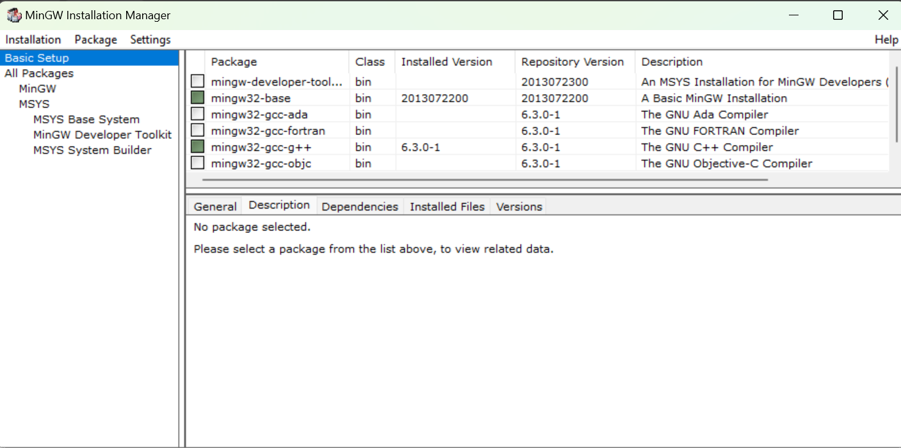
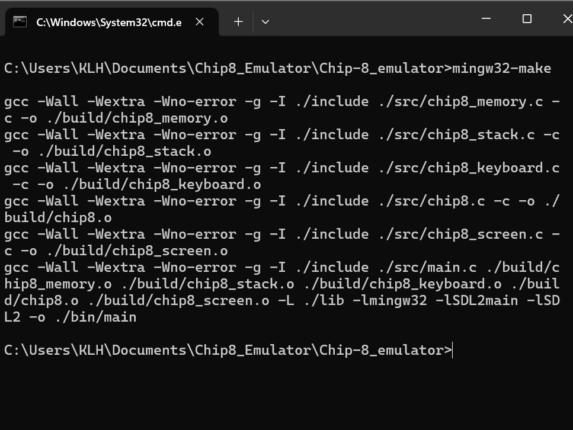
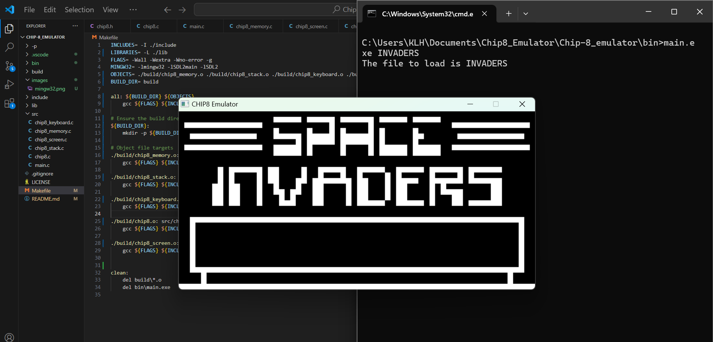

# Chip8 Emulator

A lightweight and efficient Chip8 emulator built to run classic Chip8 programs and games. This project is perfect for understanding the fundamentals of emulation, low-level programming, and retro gaming.

## Table of Contents

1. [Introduction](#introduction)
2. [Getting Started](#getting-started)
3. [Usage](#usage)
4. [Supported Instructions](#supported-instructions)


## Introduction

The Chip8 is a simple, interpreted programming language that was used on early computers in the 1970s. Its simplicity makes it a great project for learning about emulation and the inner workings of classic systems.

This emulator replicates the behavior of the Chip8 system, allowing you to load and play ROMs for educational or entertainment purposes.

## Getting Started

### Prerequisites

- MinGW 32-GCC-G++ version 6.3.0-1
- Make
- SDL2 (Simple DirectMedia Layer) library for graphics and input handling.
- 

### Installation

1. Clone the repository:

   ```bash
   git clone https://github.com/Alpha-Coder11/Chip-8_emulator.git
   ```

2. Configure the build:

   ```
   Navigate to the Project Folder
   ```

3. Build the project:

   Type <b>mingw32-make</b> in Command Line and hit enter
   
   

4. Download the ROM File 

    Go to [Zophar's Domain](https://www.zophar.net/pdroms/chip8/chip-8-games-pack.html)
    Download and Extract the ROMS.
    Copy the INVADERS to bin folder of our repo.

5. Run the emulator:

   ```bash
   Navigate to bin folder
   ```
   Type main.exe INVADERS
   

   Alternatively, you can stay in the root folder and use <b>mingw32-make run</b>. It will build the code and run the INVADER automatically. If you want to change the game you want to play,
   you can just change the game in the bin directory and update <b>ROM</b> variable.

## Usage

1. Place your Chip8 ROM files in the `bin` directory.
3. Use the keyboard to interact with the program. Default key mappings correspond to the Chip8 hex keypad:
   ```
   1 2 3 C       -->   1 2 3 4
   4 5 6 D       -->   Q W E R
   7 8 9 E       -->   A S D F
   A 0 B F       -->   Z X C V
   ```

## Supported Instructions

This emulator supports the entire Chip8 instruction set, including:

- Arithmetic operations
- Conditional and unconditional jumps
- Timer management
- Display and input handling

Refer to [Cowgod's Chip-8 Technical Reference](http://devernay.free.fr/hacks/chip8/C8TECH10.HTM) for detailed information about the instruction set.

## Contributing

Contributions are welcome! Feel free to fork the repository, submit issues, or create pull requests. 

### Notes to Self
- Two things I learned while building this project, one is forward declaration and the other is memset on 2D array. Current problem is invaders is not working properly with thi emulator version.


